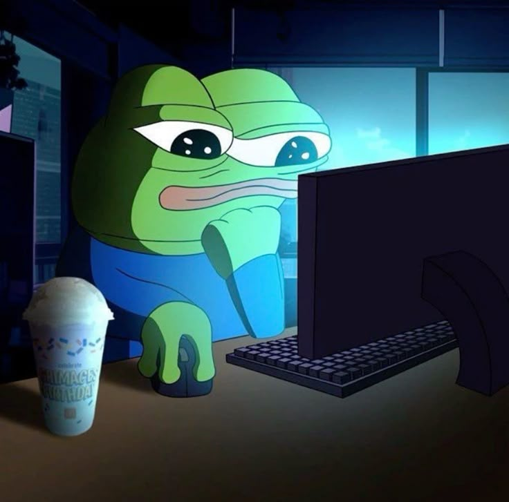

  

# Olá, eu sou Ariessa Velasques! 👋

Sou estudante de Engenharia de Software na Universidade Federal do Pampa (UNIPAMPA), e uma verdadeira entusiasta de tecnologia. Minha paixão é construir soluções completas como desenvolvedora fullstack e dar vida a mundos interativos através da criação de jogos! 🚀

---

### 🚦 Sobre Mim

- 🎓 Cursando o 6º semestre de **Engenharia de Software**.
- 👩‍💻 Apaixonada por criar **sites e aplicações interativas**, transformando ideias em experiências digitais.
- 🎮 Gamer dedicada! Adoro a precisão dos **jogos de ritmo** e a imersão de **RPGs de grinding**.
- 🐱 Tenho vários gatos, os melhores companheiros de programação (quando não estão deitados no teclado).
- 🐸 Colecionadora de sapos (digitais, por enquanto!).

---

### 💡 Minhas Explorações e Projetos

Minha curiosidade me levou a experimentar um pouco de tudo no universo do desenvolvimento. Aqui estão algumas das minhas aventuras:

-   **Narrativas Interativas:** Criei visual novels com **Ren'Py** e **Python**, unindo roteiro e lógica de programação para contar histórias.
-   **Desenvolvimento de Mundos:** Modelei e programei mapas e experiências no **Roblox Studio** utilizando **Lua**.
-   **Modding de Jogos:** Aventurei-me na modificação de jogos como **Minecraft**, personalizando códigos para criar novas funcionalidades.
-   **Criação de Jogos 2D:** Explorei a construção de RPGs clássicos com ferramentas como o **RPG Maker**.

---

### 🛠️ Tecnologias e Ferramentas

# 📊 GitHub Stats:

---

### 📫 Vamos Conversar?

Fique à vontade para se conectar comigo e trocar ideias!

> "Codando entre sapos, gatos e uns bugs perdidos pelo caminho." 🐸🐱
